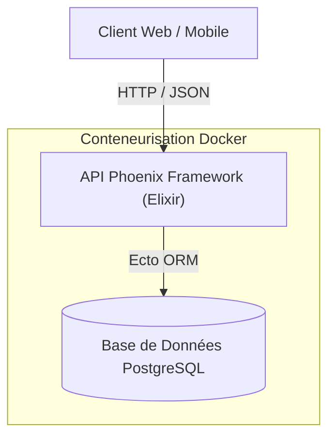

# 🚀 Elixir / Phoenix Backend API (T-POO-700)


Un service Backend robuste développé avec **Elixir**, le framework web **Phoenix**, et **PostgreSQL**, conteneurisé avec **Docker & Docker Compose**. 
Ce projet a été réalisé dans le cadre du cursus Epitech MSc Pro (module `T-POO-700`).

---

## 📌 Fonctionnalités Principales

- ⚡ **Performance & Concurrence** : Exploitation de la machine virtuelle BEAM et des processus Erlang d'Elixir.
- 🗄️ **Base de données avec Ecto** : Intégration de PostgreSQL via Ecto ORM avec migrations et schémas typés.
- 🌐 **Architecture API REST & WebSockets** : Routes optimisées et contrôleurs Phoenix typés JSON / HTML.
- 🐳 **Conteneurisation complète** : Déploiement simplifié via `docker-compose`.
- 🛠️ **Outils de développement** : Support de Phoenix LiveDashboard (`/dev/dashboard`) et Mailbox Preview (`/dev/mailbox`).

---

## 🛠️ Stack Technique

- **Langage** : [Elixir 1.14+](https://elixir-lang.org/)
- **Framework Web** : [Phoenix Framework 1.7](https://www.phoenixframework.org/)
- **OR/M & Base de données** : Ecto SQL + PostgreSQL
- **Gestionnaire d'actifs** : TailwindCSS + Esbuild
- **Déploiement** : Docker & Docker Compose

---

## 🏗️ Architecture du Projet



### Structure des Dossiers

```text
.
├── Api/
│   ├── api/                   # Application Phoenix (code source Elixir)
│   │   ├── config/            # Configurations (dev, test, prod, runtime)
│   │   ├── lib/               # Modèles, Contextes Ecto et Contrôleurs Web
│   │   ├── priv/              # Migrations Ecto et Seeds de BDD
│   │   ├── test/              # Suite de tests unitaires et d'intégration
│   │   └── mix.exs            # Dépendances du projet Elixir
│   ├── Dockerfile             # Configuration d'image Docker
│   └── docker-compose.yml     # Orchestration des services (API + PostgreSQL)
└── README.md
```

---

## 🚀 Prise en main rapide

### Option 1 : Avec Docker Compose (Recommandé)

1. **Lancer l'application et la base de données** :
   ```bash
   cd Api
   docker-compose up -d --build
   ```

2. **Accéder à l'API** :
   - L'API sera accessible sur `http://localhost:4000`.

---

### Option 2 : Exécution Locale (Développement)

#### Prérequis
- **Elixir** >= 1.14 & **Erlang** instalés
- **PostgreSQL** en cours d'exécution localement

#### Étapes de lancement

1. **Accéder au répertoire du code** :
   ```bash
   cd Api/api
   ```

2. **Installer les dépendances Elixir** :
   ```bash
   mix deps.get
   ```

3. **Créer et migrer la base de données** :
   ```bash
   mix ecto.setup
   ```

4. **Démarrer le serveur Phoenix** :
   ```bash
   mix phx.server
   ```
   *Ou en mode interactif avec IEx :*
   ```bash
   iex -S mix phx.server
   ```

5. Rendez-vous sur `http://localhost:4000` dans votre navigateur.

---

## 🧪 Exécution des Tests

Pour exécuter la suite de tests automatisés :
```bash
cd Api/api
mix test
```

---

## 📄 Licence & Crédits

- Projet développé par **[@nux89](https://github.com/nux89)** dans le cadre de la formation Epitech.
